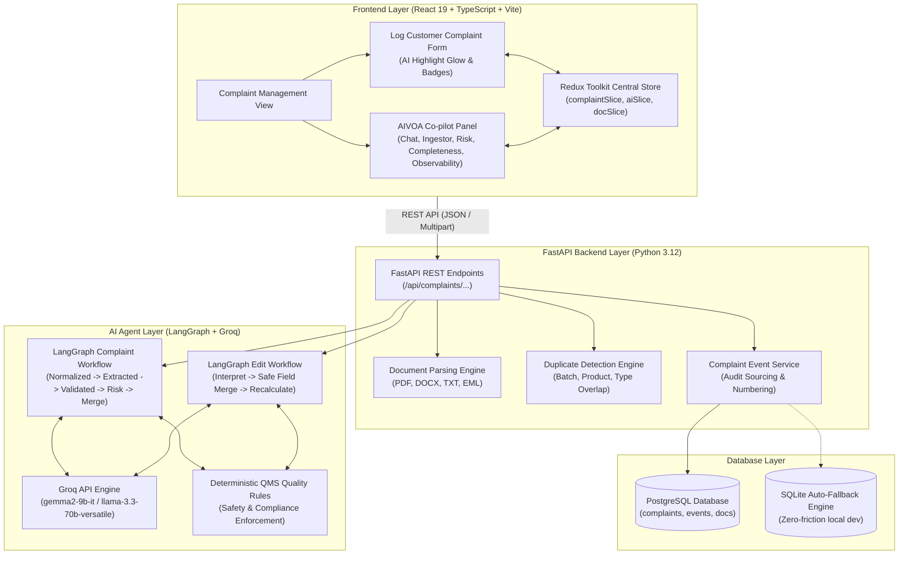
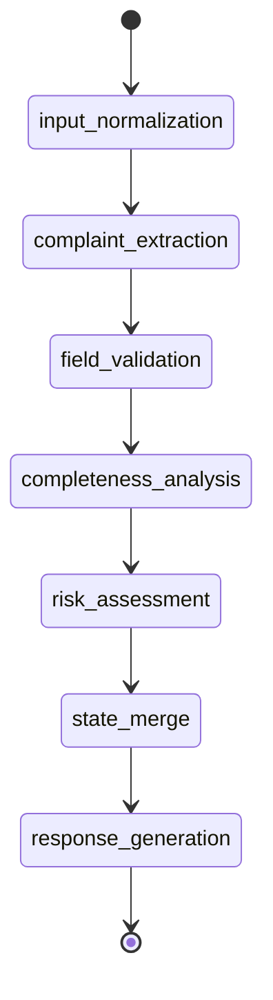
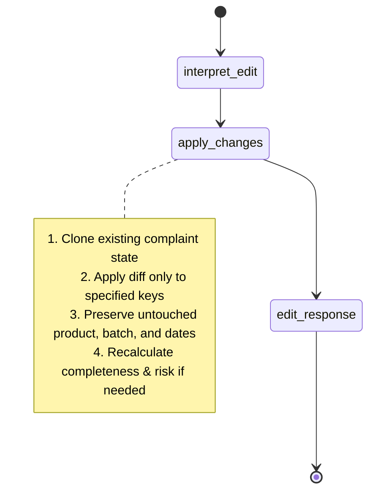
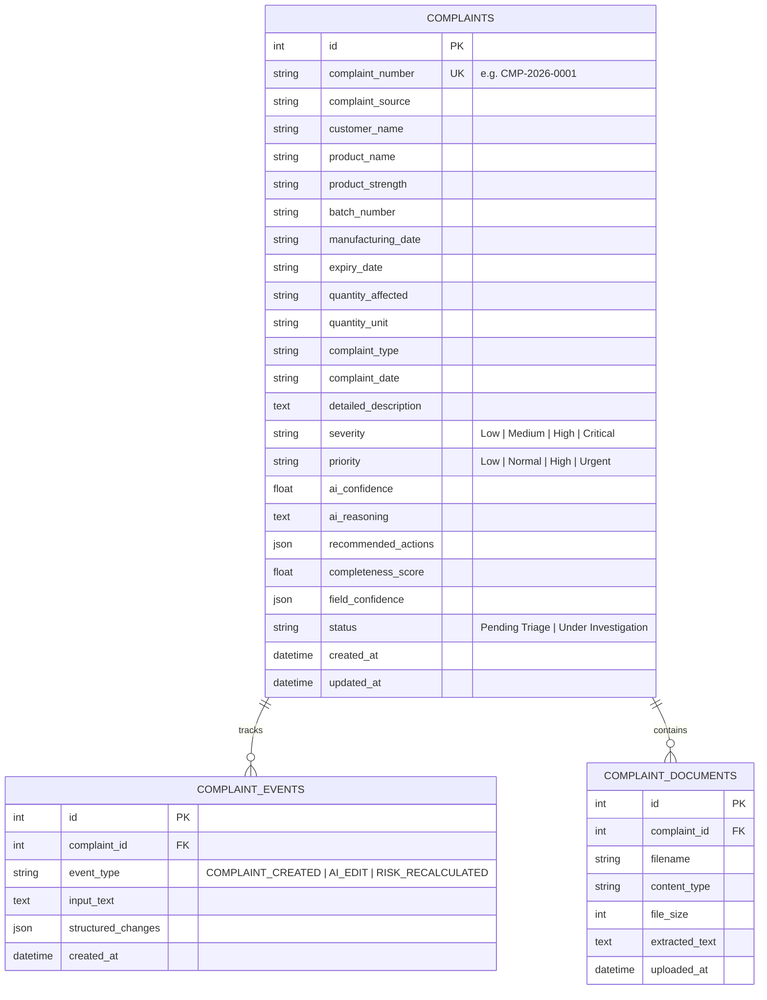

# AIVOA Pharmaceutical Complaint Management System — Architecture

## 1. System Architecture Overview

The AIVOA Complaint Management System is an enterprise-grade AI-native quality assurance platform designed for pharmaceutical Active Pharmaceutical Ingredient (API) and Finished Dosage Form (FDF) manufacturing. It automates complaint intake, structured parameter extraction, natural language edits, and deterministic quality triage.



---

## 2. End-to-End Data Flow

1. **Intake / Ingestion**: User inputs natural language text via chat or uploads a complaint document (`PDF`, `DOCX`, `TXT`, `EML` up to 10 MB).
2. **Text Normalization**: Document parser extracts raw text; LangGraph normalizes whitespace, formats dates, and initializes audit metadata.
3. **Structured Extraction**: LangGraph dispatches prompts to Groq running `gemma2-9b-it` (with fallback to `llama-3.3-70b-versatile` or deterministic rules).
4. **Validation & Quality Triage**: Extracted parameters are validated against standard pharmaceutical QMS dictionaries.
5. **Deterministic Risk Assessment**: Safety rules evaluate indicators (foreign particles, black specks, sterility, OOS assay) to classify Severity (`Low`, `Medium`, `High`, `Critical`) and Priority (`Low`, `Normal`, `High`, `Urgent`).
6. **Completeness Audit**: QMS completeness score (0-100%) is calculated, highlighting missing critical vs. optional fields.
7. **Redux Dispatch**: Structured JSON response updates Redux store, triggering live visual glow pulses and "✨ AI updated" badges on modified form fields.
8. **QMS Persistence**: When the user clicks "Save Complaint", a standardized sequential ID (`CMP-2026-XXXX`) is assigned, persisting the record and event logs to PostgreSQL.

---

## 3. LangGraph State Machine Workflows

### 3.1 Complaint Intake Graph (`complaint_workflow`)


### 3.2 Natural-Language Edit Graph (`edit_workflow`)
The edit workflow enforces strict **safe merge semantics**: only the target fields specified by the user are modified; all other fields are 100% preserved.



---

## 4. Redux Store State Hierarchy

Redux Toolkit acts as the single source of truth for the frontend application:

```text
RootState
├── complaint: ComplaintState
│   ├── data: ComplaintData (source, customer, product, batch, dates, quantity, description, severity, priority)
│   ├── updatedFields: string[] (tracks recently modified fields for UI highlight animation)
│   ├── lastSaved: SaveComplaintResponse | null
│   └── isSaved: boolean
│
├── ai: AIState
│   ├── messages: ChatMessage[] (chat history with rich markdown formatting)
│   ├── loading: boolean
│   ├── statusText: string (e.g. "Extracting entities...", "Assessing risk...")
│   ├── auditTrail: StepAuditLog[] (LangGraph node-by-node execution logs)
│   ├── riskAssessment: RiskAssessment | null
│   ├── completeness: CompletenessAssessment | null
│   ├── duplicateWarning: DuplicateMatch | null
│   └── isObservabilityOpen: boolean
│
├── document: DocumentState
│   ├── isDragging: boolean
│   ├── uploading: boolean
│   ├── progress: number (0-100)
│   ├── currentFile: { name, size, type } | null
│   └── error: string | null
│
└── ui: UIState
    ├── showSavedModal: boolean
    ├── savedComplaintsList: HistoricalComplaint[]
    ├── selectedComplaintDetail: HistoricalComplaint | null
    └── toast: { type, message } | null
```

---

## 5. PostgreSQL Database Schema


