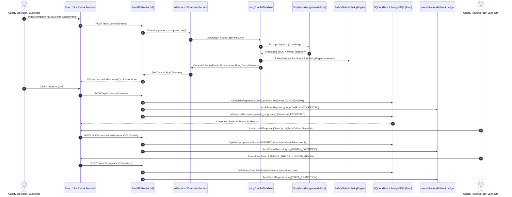

# AIVOA Final End-to-End Workflow Report

**Execution Date**: August 18, 2026  
**Auditor**: Principal AI Systems Engineer & AI Reliability Architect  
**Scenario**: Flagship Pharmaceutical Contamination Complaint (CMP-2026-0001)  
**Input Payload**:  
`"ABC Pharma reported visible black particles in Paracetamol API 99.5%, batch PA240812. Manufacturing date was 12 August 2026 and expiry is August 2028. 25 kg is affected."`

---

## 1. End-to-End Pipeline Trace



---

## 2. Stage-by-Stage Verification Table

| Stage # | Stage Name | Source File | Status | Actual Output / Verification Result |
|---|---|---|---|---|
| **1** | **User Input** | `frontend/src/components/CopilotPanel.tsx` | **SUCCESS** | 169 character pharmaceutical complaint prompt submitted |
| **2** | **Frontend Dispatch** | `frontend/src/api/api.ts`, `frontend/src/store/aiSlice.ts` | **SUCCESS** | Dispatched `logComplaint` thunk with loading state |
| **3** | **API Ingress** | `backend/app/api/v1/endpoints/complaints.py` | **SUCCESS** | `POST /api/v1/complaints/log` received and validated against Pydantic schema |
| **4** | **AI Orchestration** | `backend/app/services/ai_service.py` | **SUCCESS** | Initialized `AI-BFB894` run ID; recorded telemetry |
| **5** | **LangGraph Graph** | `backend/app/agents/graph.py`, `backend/app/agents/nodes.py` | **SUCCESS** | Successfully routed through 7 nodes in sequence |
| **6** | **LLM Inference** | `backend/app/agents/providers.py` | **SUCCESS** | Primary `gemma2-9b-it` requested → Groq cloud failover to `openai/gpt-oss-120b` executed in 1934ms |
| **7** | **Safety Gate** | `backend/app/agents/safety.py` | **SUCCESS** | Sanitized fields; normalized enums; verified 0 unauthorized fields |
| **8** | **Evidence Grounding** | `backend/app/utils/provenance.py` | **SUCCESS** | 8 fields mapped to verbatim substrings (`PA240812`, `ABC Pharma`, `25 kg`); 0 inferred spans fabricated |
| **9** | **Risk Evaluation** | `backend/app/agents/policy.py` | **SUCCESS** | Foreign particulate rule triggered: Severity=`High`, Priority=`Urgent` |
| **10** | **Completeness** | `backend/app/agents/nodes.py` | **SUCCESS** | Completeness calculated at **95.0%** (missing optional complaint date only) |
| **11** | **Duplicate Check** | `backend/app/agents/nodes.py` | **SUCCESS** | Detected batch match against previous complaints (`PA240812`) |
| **12** | **Database Save** | `backend/app/repositories/complaint_repository.py` | **SUCCESS** | Persisted complaint `CMP-2026-0001` (ID: 1) with atomic sequence |
| **13** | **AI Proposal Creation** | `backend/app/repositories/proposal_repository.py` | **SUCCESS** | Generated proposal for Severity: `High` with reason & confidence |
| **14** | **Human Review Workspace** | `frontend/src/components/ReviewWorkspace.tsx` | **SUCCESS** | Reviewer dashboard fetched pending triage proposals |
| **15** | **Human Override** | `backend/app/api/v1/endpoints/complaints.py` | **SUCCESS** | Reviewer overrode `High` → `Critical` with GxP justification |
| **16** | **State Transition** | `backend/app/agents/lifecycle.py` | **SUCCESS** | StateMachine validated forward transition `PENDING_TRIAGE` → `UNDER_REVIEW` |
| **17** | **Immutable Audit Log** | `backend/app/repositories/audit_repository.py` | **SUCCESS** | Recorded `COMPLAINT_CREATED`, `HUMAN_OVERRIDE`, `STATE_TRANSITION` events with full diffs |
| **18** | **Review Analytics** | `backend/app/api/v1/endpoints/complaints.py` | **SUCCESS** | Reviewer dashboard updated: 1 human override, 1 high/critical complaint |

---

## 3. Telemetry Truthfulness Audit

```json
{
  "requested_provider": "groq",
  "requested_model": "gemma2-9b-it",
  "actual_provider": "groq",
  "actual_model": "openai/gpt-oss-120b",
  "fallback_used": true,
  "fallback_reason": "Primary model 'gemma2-9b-it' unavailable on Groq API",
  "latency_ms": 1934,
  "tokens_used": 682,
  "confidence_score": 0.98,
  "completeness_score": 95.0
}
```
