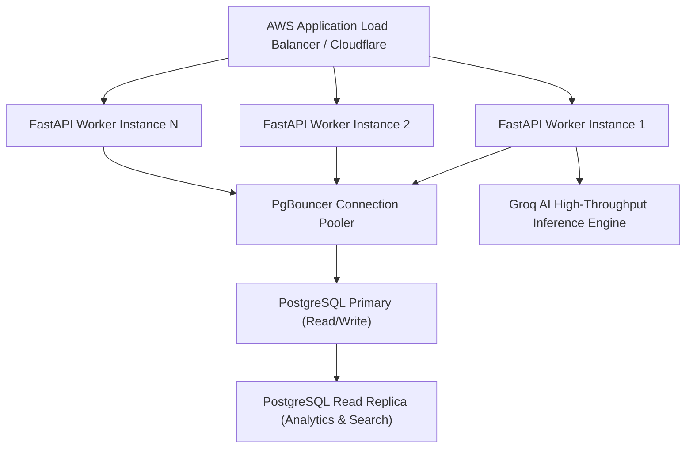

# AIVOA Enterprise Scalability Architecture & Growth Roadmap

## 1. Modular Monolith Architecture Rationale

The AIVOA system deliberately adopts a **High-Cohesion Modular Monolith** architecture:
- Avoids distributed transaction overhead, network latency, and eventual consistency failures in regulated QMS environments.
- Maintains strict domain separation between `agents/`, `models/`, `repositories/`, `services/`, and `api/` layers.
- Supports linear horizontal scaling with stateless worker containers.

---

## 2. Horizontal Scaling & High Availability

---

## 3. Scalability Milestones

### Phase 1: Single Instance (0 - 50,000 complaints / year)
- Single 2 vCPU / 4 GB RAM container running FastAPI + Uvicorn workers.
- PostgreSQL RDS with automated snapshots and daily backups.
- In-memory rate limiting and idempotency caching.

### Phase 2: Scaled Cluster (50,000 - 1,000,000 complaints / year)
- Multi-container ECS / Kubernetes deployment behind Application Load Balancer.
- PgBouncer managing pooled database connections.
- Redis-backed distributed token-bucket rate limiter and idempotency store.
- Read replicas dedicated to heavy analytical QMS reporting queries.

### Phase 3: Global Enterprise (1,000,000+ complaints / year)
- Regional deployments with localized data residency for EU GDPR / US HIPAA compliance.
- Asynchronous Celery / ARQ workers for bulk legacy document batch processing.
- Vector database (pgvector / Pinecone) for multi-million record semantic duplicate clustering.
