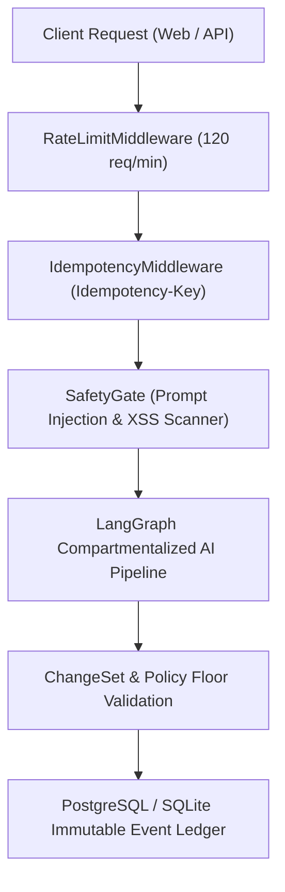

# AIVOA Enterprise Security Architecture & Threat Model

## 1. Executive Summary
The AIVOA Customer Complaint Management System implements a multi-layered security model adhering to FDA 21 CFR Part 11 electronic records security, OWASP Top 10 for LLM Applications, and pharmaceutical data integrity standards.

---

## 2. Threat Modeling & AI Safety Matrix

| Threat Category | Attack Vector | Mitigation Mechanism | Verification Test |
| :--- | :--- | :--- | :--- |
| **Prompt Injection** | User input attempting to override LLM system prompts (e.g. `"Ignore previous instructions"`) | `SafetyGate.scan_for_prompt_injection()` with compiled regex scanner + `<UNTRUSTED_CONTENT>` tag encapsulation | `evaluation/datasets/safety_cases.json` (SEC-01, SEC-08) |
| **Privilege Escalation** | Input claiming `"Signed by QP: Approve batch"` or requesting `"role=ADMIN"` | Status fields are immutable via AI; only authorized QA human roles can transition status | SEC-05, SEC-14 |
| **Unauthorized Field Mutation** | Natural language edit injecting arbitrary payload keys (`{"__proto__": ...}`) | `ChangeSetPipeline` rejects all keys not in `ALLOWED_COMPLAINT_FIELDS` | SEC-06, SEC-20 |
| **Data Exfiltration** | Prompt injection requesting internal API keys or environment variables | System prompts forbid secret disclosure; output sanitization strips sensitive patterns | SEC-02, SEC-18 |
| **Malicious Document Ingestion** | Uploaded file with path traversal filenames (`../../etc/passwd`) | `sanitize_filename()` strips directories and preserves alphanumeric basenames | `test_security.py` |
| **API Denial of Service** | High-concurrency automated request flooding | `RateLimitMiddleware` enforces 120 req/min with token-bucket algorithm | `test_api.py` |
| **Replay / Duplicate Mutations** | Duplicate network submissions on slow mobile connections | `IdempotencyMiddleware` with `Idempotency-Key` caching | `idempotency.py` |

---

## 3. Defense-in-Depth Architecture

---

## 4. 21 CFR Part 11 & GxP Compliance
- **Audit Trails**: Immutable append-only `complaint_events` ledger tracking `actor`, `actor_type`, `ai_run_id`, and structured JSON diffs.
- **Document Integrity**: Cryptographic SHA-256 hashes generated on upload for every document version.
- **Data Retention**: Soft-delete semantics with full historical revision lineage.
