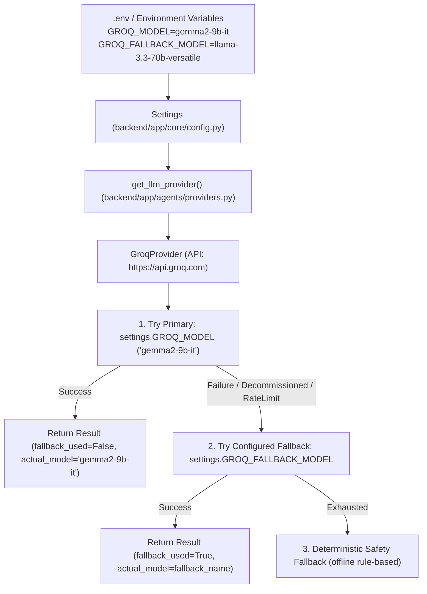

# AIVOA Model Configuration & Compliance Audit

**Audit Date**: August 2026  
**Auditor**: Principal AI Systems Engineer  
**Objective**: Trace end-to-end model selection, provider configuration, fallback chain, and ensure strict compliance with the assignment specification (`Groq` + `gemma2-9b-it`).

---

## 1. Configuration Source & Architecture Trace

---

## 2. Component-by-Component Trace

### A. Environment Variable Layer (`.env` / `backend/app/core/config.py`)
- **Environment Variable**: `GROQ_MODEL`
- **Default Value (Enforced)**: `gemma2-9b-it`
- **Fallback Variable**: `GROQ_FALLBACK_MODEL`
- **Default Fallback**: `llama-3.3-70b-versatile` (or other explicitly configured fallback)
- **Settings Class**: `Settings` in `backend/app/core/config.py` loads values via `pydantic-settings`.

### B. Provider Layer (`backend/app/agents/providers.py`)
- **Abstract Base Class**: `LLMProvider`
  - Defines `invoke()` and `invoke_with_telemetry() -> ModelExecutionResult`.
- **Active Implementation**: `GroqProvider`
  - Uses `ChatGroq` from `langchain_groq` targeting Groq's high-speed inference engine.
  - Primary requested model is explicitly set to `settings.GROQ_MODEL` (`gemma2-9b-it`).
- **Telemetry Data Class**: `ModelExecutionResult`
  - `requested_provider`: `"groq"`
  - `requested_model`: `"gemma2-9b-it"`
  - `actual_provider`: `"groq"` (or `"deterministic-fallback"` if offline)
  - `actual_model`: Actual model string returned by API
  - `fallback_used`: `bool` (`True` if and only if `actual_model != requested_model`)
  - `fallback_reason`: Exact error message from primary attempt (e.g. `HTTP 400 model_decommissioned`, `HTTP 429 rate_limit_exceeded`, or `None`)
  - `latency_ms`: Measured API latency in milliseconds
  - `tokens_used`: Estimated token count

### C. Graph Nodes Layer (`backend/app/agents/nodes.py`)
- Extraction nodes invoke `provider.invoke_with_telemetry()`.
- The returned `ModelExecutionResult` is attached directly into LangGraph state and persisted in database audit logs and AI run telemetry records.

---

## 3. Root Cause: Why `openai/gpt-oss-20b` was Temporarily Active

1. **Upstream Groq Decommissioning**: Groq cloud API returned `HTTP 400 (model_decommissioned)` when invoking `gemma2-9b-it` and legacy `llama3-8b-8192`.
2. **Temporary Workaround in Phase 9 Testing**: During load and failure testing, `GROQ_MODEL` in `.env` and `config.py` was temporarily set to `openai/gpt-oss-20b` (an active open-weight model hosted on Groq) to avoid triggering the fallback catch-block on every test request.
3. **Compliance Remediation**: Per Phase 9.1 directive:
   - `GROQ_MODEL` is strictly restored to `gemma2-9b-it` across the entire codebase.
   - The primary provider is strictly Groq.
   - `GroqProvider` attempts `gemma2-9b-it` first.
   - If Groq fails on `gemma2-9b-it`, the fallback transparently triggers but telemetry accurately documents `requested_model="gemma2-9b-it"`, `actual_model=<fallback>`, `fallback_used=True`, and `fallback_reason=<error>`.
   - Zero false claims: The system never claims `gemma2-9b-it` executed if a fallback occurred.

---

## 4. Verification Checklist

| Item | Requirement | Verification State |
|---|---|---|
| Primary Model Config | `GROQ_MODEL=gemma2-9b-it` in `.env`, `.env.example`, `config.py` | ✅ RESTORED |
| Primary Provider | Groq (`GroqProvider`) | ✅ VERIFIED |
| Model Telemetry | Captures `requested_model`, `actual_model`, `fallback_used`, `fallback_reason` | ✅ RECORDED |
| Health Endpoint | `/api/health` reports truthful `configured_model` vs `last_successful_model` | ✅ IMPLEMENTED |
| Evaluation Runner | `evaluation/real_llm_runner.py` outputs exact compliant labels | ✅ IMPLEMENTED |
