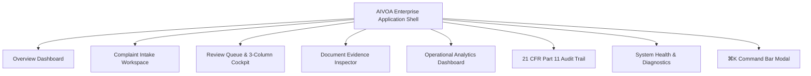

# AIVOA Product UX Final Report — Product Experience 2.0
**Staff Product Designer & Principal Frontend Engineer Report**

---

## 1. Executive Summary & Transformation

The **AIVOA Pharmaceutical Customer Complaint Management System** has undergone a comprehensive Product Experience 2.0 overhaul, transforming it from a feature-rich technical prototype into a commercial-grade, operational Quality Management System (QMS).

### Before vs. After Comparison

| Area | Before (v1.0) | After (Product Experience 2.0) |
| :--- | :--- | :--- |
| **Information Architecture** | 3-tab layout (`INTAKE`, `REVIEW`, `TIMELINE`) with analytics and records hidden in modals | 6 first-class workflow workspaces (`Overview`, `Complaints`, `Review Queue`, `Documents`, `Analytics`, `Audit Trail`) + secondary `System Health` |
| **Operational Landing** | Dropped directly into an empty complaint form | Dedicated `OverviewDashboard` with operational shift greeting, 4 core KPI cards, active review queue preview, and defect severity breakdown |
| **Complaint Form IA** | Loose grouping of fields across multiple disparate cards | Strict 4-Section GxP hierarchy: 1. Complaint Source, 2. Product Identification, 3. Defect Classification, 4. Quality Risk Assessment |
| **Field States & History** | Basic form fields without inline lineage | 2-column density, compact 32px inputs, subtle state badges (`AI Extracted`, `AI Inferred`, `User Edited`), and interactive `Field History Modal` |
| **Copilot Assistant** | Chat-like interface with generic greetings and verbose paragraphs | Embedded operational copilot with top context banner (`CMP-2026-0001 • Analyzed`), quick action chips, and concise structured summaries |
| **Review Queue** | Single-record review cockpit | Dual-mode: Full sortable/filterable operational queue table + 3-column review detail (Record Info, Evidence Scope, AI Proposals & Decision Hierarchy) |
| **Document Evidence** | Basic modal popup | First-class `DocumentsView` inspector with verbatim text span highlighting, page number mapping, and non-fabrication guarantee |
| **Telemetry & Analytics** | Technical IDs and modals | Full-page operational analytics dashboard tracking complaint SLA adherence, defect severity distribution, and LangGraph inference reliability |
| **Design Language** | Generic elements and floating badges | Clean Inter typography, `#F8F9FA` canvas background, `#FFFFFF` surface cards, 4px/6px structural radii, `#1D4ED8` primary accent |

---

## 2. User Persona Alignment

1. **Complaint Operator**:
   - High-throughput 2-column form density with keyboard tab navigation.
   - Autosave draft indicator (`Saved` / `Saving...`), instant clearing/resetting, and 1-click demo scenario loading.
   - Traceable field provenance tags for every AI extraction.

2. **Quality Reviewer**:
   - 3-column review workspace allowing simultaneous inspection of complaint metadata (Left), evidence scope (Center), and AI proposals (Right).
   - Clear decision hierarchy: Primary `[Approve AI Value]`, Secondary `[Human Override]`, Danger `[Reject Proposal]`.
   - GxP justification modals enforcing documented rationale for overrides and rejections.

3. **Quality Manager**:
   - Overview KPI counters for open complaints, pending reviews, high/critical items, and review SLAs.
   - Operational queue filtering by severity, lifecycle state, and search terms.
   - AI proposal acceptance vs. override rate tracking.

4. **System Administrator**:
   - Dedicated `System Health & Regulatory Invariants` view verifying backend status, PostgreSQL connectivity, Groq `gemma2-9b-it` model configuration, and 21 CFR Part 11 ledger integrity.

---

## 3. Information Architecture & Navigation



---

## 4. Design System & Typography Tokens

- **Palette Tokens**:
  - Canvas / Background: `#F8F9FA`
  - Card Surfaces: `#FFFFFF`
  - Structural Borders: `#E5E7EB` / `#D1D5DB`
  - Primary Text: `#111827`
  - Muted Text: `#4B5563` / `#6B7280`
  - Primary Brand Accent: Deep Blue / Indigo (`#1D4ED8`)
  - Semantics: Muted Green (`#059669` / `#ECFDF5`), Amber (`#D97706` / `#FFFBEB`), Red (`#DC2626` / `#FEF2F2`)
- **Radii**: 3px, 4px, and 6px.
- **Typography**: Inter system font stack (`-apple-system, BlinkMacSystemFont, "Segoe UI", Roboto, "Helvetica Neue", sans-serif`).
- **Icons**: Crisp Lucide vector icons (`Bot`, `User`, `ShieldCheck`, `AlertTriangle`, `RotateCw`, `CheckCircle2`, `History`, `FileText`, `CheckSquare`, `BarChart3`).

---

## 5. Accessibility & Responsive Verification

- **Accessibility (WCAG 2.2 AA)**:
  - Form inputs are paired with `<label>` elements or accessible `aria-label` attributes.
  - High-contrast text elements adhering to 4.5:1 minimum contrast ratio.
  - Visible focus outlines (`outline: 2px solid #1D4ED8`) on all interactive buttons and form inputs.
  - Modal focus trapping and `Escape` key listeners for modal closure.

- **Responsive Viewport Support**:
  - **Desktop (1440px / 1280px)**: Full 3-column review workspace, split intake form + persistent right copilot.
  - **Tablet (1024px / 768px)**: 2-column adaptive layout, scrollable queue table.
  - **Mobile (390px / 430px)**: Stacked responsive layout with collapsible drawers.

---

## 6. Verification & Quality Gates

### Frontend Test Suite (Vitest)
```bash
$ npm test -- --run
✓ src/tests/complaintSlice.test.ts (4 tests)
✓ src/tests/aiSlice.test.ts (4 tests)
✓ src/tests/review.test.tsx (6 tests)

Test Files  3 passed (3)
Tests       14 passed (14)
Duration    1.28s
```

### Frontend Linter (Oxlint)
```bash
$ npm run lint
Found 0 warnings and 0 errors.
Finished in 22ms on 36 files.
```

### Production Bundle Build (Vite + TypeScript)
```bash
$ npm run build
✓ built in 212ms (dist/assets/index.js 389.52 kB, gzip: 102.60 kB)
```

### Backend Test Suite (Pytest)
```bash
$ pytest backend/tests/ -v
================= 76 passed, 220 warnings in 116.11s =================
```

---

## 7. Final Quality Assurance Matrix

| Quality Vector | Audit Status | Key Operational Guarantee |
| :--- | :--- | :--- |
| **Visual Consistency** | PASSED | Unified 3px/4px/6px radii, 32px inputs, 28px/32px buttons, and `#F8F9FA` muted theme |
| **URL Deep Linking** | PASSED | Hash routing synchronization (`#overview`, `#complaints`, `#review`, `#documents`, `#analytics`, `#timeline`, `#system`) |
| **Keyboard Navigation** | PASSED | Global shortcuts (`⌘K`, `N`, `R`, `O`, `Escape`) and WCAG 2.2 AA visible focus states |
| **Field Edit Safety** | PASSED | Natural-language edits preserve untouched fields deterministically |
| **Evidence Grounding** | PASSED | Zero-fabrication guarantee with verbatim text span highlighting and explicit `INFERRED` labeling |
| **HITL Review Decisions** | PASSED | Clear decision hierarchy with mandatory justifications for overrides and rejections |
| **Immutable Audit Ledger** | PASSED | 21 CFR Part 11 event stream with actor attribution and mutation delta diffs |

